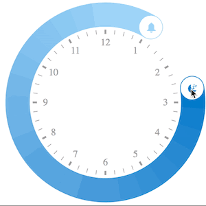

# ngx-circular-slider
### powered by [craftworks GmbH](https://craftworks.at) used in the own TimeTracking Product
#### inspired by iOS bedtime and [react-native-circular-slider](https://github.com/bgryszko/react-native-circular-slider)



## Installation

To install this the slider, run:

```bash
$ npm install ngx-circular-slider --save
```

## Consuming your ngx-circular-slider

You can import the slider in any Angular application by running:

```bash
$ npm install ngx-circular-slider
```

and then from your Angular `AppModule`:

```typescript
import { BrowserModule } from '@angular/platform-browser';
import { NgModule } from '@angular/core';

import { AppComponent } from './app.component';

// Import your library
import { NgxCircularSliderModule } from 'ngx-circular-slider';

@NgModule({
  declarations: [
    AppComponent
  ],
  imports: [
    BrowserModule,

    NgxCircularSliderModule
  ],
  providers: [],
  bootstrap: [AppComponent]
})
export class AppModule { }
```

Once the ngx-circular-slider module is imported, you can use it in your Angular application:

```xml
<!-- You can now use the slider in app.component.html -->

<ngx-cs-slider></ngx-cs-slider>
```

## todos
* test module api
* adapt readme
* replace gulp with webpack
* generate types without *.d.ts
* fixes module-api
* tests

## Development

Use [angular-cli](https://github.com/angular/angular-cli) tools to generate, test and lint your code.
Put your library code in **src/app/library** folder. Only this folder and subfolders will be published.

To generate library's `*.js`, `*.d.ts` and `*.metadata.json` files:
```bash
$ npm run publish
```

To generate the doc:
```bash
$ npm run docs
```

## License

MIT © [Alexander Zulechner@craftworks GmbH](alexander.zulechner@craftworks.at)
